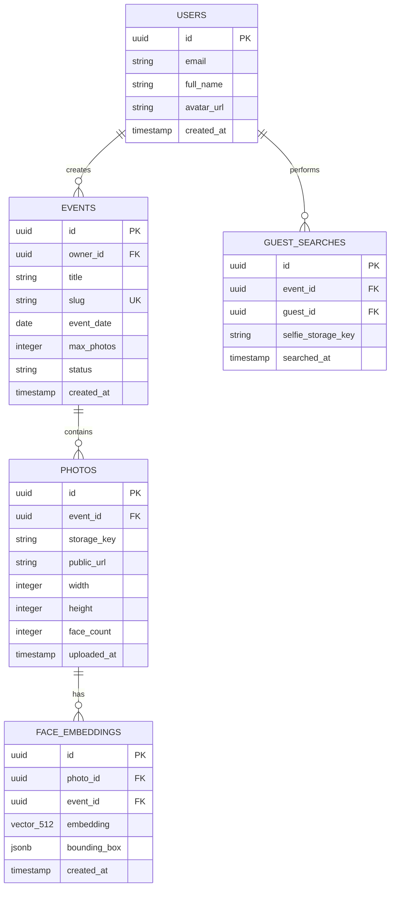
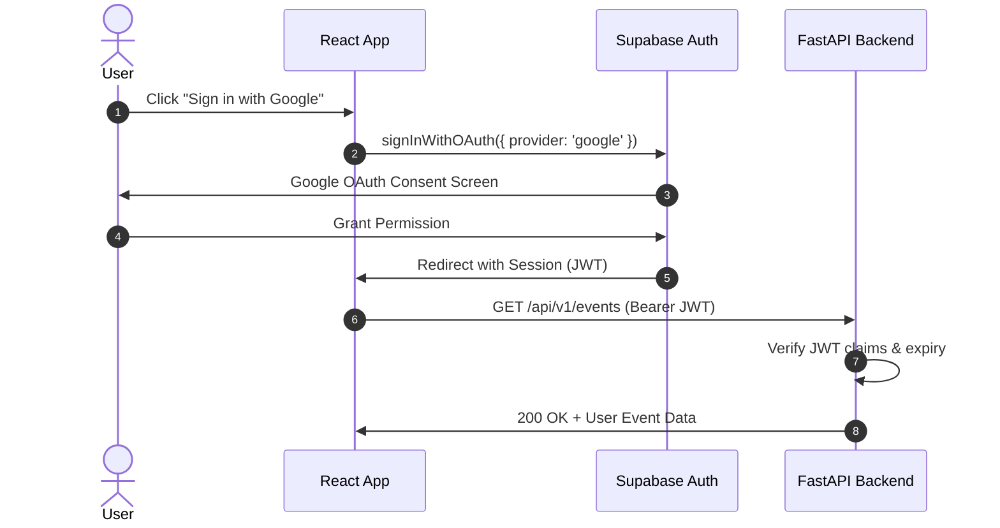

# SmartSharePhoto — Software Architecture & Technical Implementation Blueprint

**Project Name:** SmartSharePhoto  
**Document Type:** Lead Software Architecture & System Design Blueprint  
**Version:** 1.0.0 (V1 MVP Phase)  
**Cost Target:** ₹0 / $0 per month (100% Free Tier Infrastructure)  
**Target Scale:** Personal/Student MVP (4–7 guests/event, max 150 photos/event)

---

## 1. Product Overview

**SmartSharePhoto** is an AI-powered, event photo-sharing web application. It automates the distribution of event photographs to attendees using face recognition.

### Core Value Proposition
- **For Event Owners/Photographers:** Eliminates manual sorting and photo tagging. Photos are uploaded once, indexed automatically via face detection, and distributed effortlessly.
- **For Guests:** Replaces tedious searching through hundreds of event photos. Guests scan a QR code or click a shared link, authenticate via Google, submit a single selfie, and instantaneously receive a personalized gallery of their photos to download.

---

## 2. Exact User Roles & Permissions

| Role | Description | Authentication | Capabilities & Limitations |
| :--- | :--- | :--- | :--- |
| **Event Owner / Photographer** | The user who creates and manages an event and uploads official event photos. | Authenticated via Google OAuth (Supabase Auth) | - Create, view, edit, and delete events owned by them.<br>- Upload up to 150 photos per event.<br>- Trigger face embedding and indexing.<br>- Delete event photos or entire events.<br>- View event statistics (photo count, guest count).<br>- Generate & export public event links & QR codes. |
| **Guest** | An attendee who wants to find their photos from an event. | Authenticated via Google OAuth (Supabase Auth) | - Access public event page via unique link/QR code.<br>- Upload or take a live camera selfie.<br>- Trigger face matching query against event embeddings.<br>- View matching photo gallery.<br>- Download individual or bulk selected photos.<br>- *Cannot* view photos of other events or modify event data. |

---

## 3. Complete User Journeys

### 3.1 Event Owner Journey
```
[ Sign In with Google ] ──► [ Organizer Dashboard ] ──► [ Click "Create Event" ]
                                                                  │
                                                                  ▼
[ View Photo Grid / Status ] ◄── [ Upload Photos (Max 150) ] ◄── [ Fill Event Name & Date ]
             │
             ▼
[ Background Processing ] ──► [ InsightFace Embedding Extraction ] ──► [ pgvector Indexing ]
                                                                             │
                                                                             ▼
[ Printable QR Modal ] ◄─── [ Share Event Link / Generate QR ] ◄─── [ Event Status: READY ]
```

### 3.2 Guest User Journey
```
[ Scan QR / Open Shared Link ] ──► [ Public Event Preview ] ──► [ Google Auth Sign In ]
                                                                       │
                                                                       ▼
[ View Personal Gallery ] ◄── [ Vector Similarity Match ] ◄── [ Upload / Snap Selfie ]
           │
           ▼
[ Download Single / Bulk Photos ]
```

---

## 4. System Architecture

The system uses a decoupled client-server architecture designed for serverless execution and ₹0 operational cost.

```mermaid
flowchart TB
    subgraph Client ["Frontend (Vercel / Netlify Static Hosting)"]
        UI["React + Vite + Tailwind CSS"]
        Cam["Selfie Camera / File Picker"]
    end

    subgraph Auth ["Authentication (Supabase)"]
        SupaAuth["Supabase Auth (Google OAuth)"]
    end

    subgraph StorageLayer ["Object Storage"]
        R2["Cloudflare R2 / Supabase Storage (Photo Bucket)"]
    end

    subgraph Backend ["Python Backend (FastAPI on HuggingFace / Render)"]
        API["FastAPI REST API"]
        Pipeline["InsightFace ONNX Engine"]
        Worker["Background Processing Queue"]
    end

    subgraph Database ["Database & Vector Store (Supabase Postgres)"]
        PG[("PostgreSQL + pgvector")]
    end

    UI -->|1. Google Auth| SupaAuth
    UI -->|2. Upload Event Photos| API
    UI -->|3. Upload Selfie & Match| API
    API -->|4. Store Raw Images| R2
    API -->|5. Extract Embeddings (512-d)| Pipeline
    Pipeline -->|6. Store Embeddings & Meta| PG
    API -->|7. Cosine Search (pgvector)| PG
    PG -->|8. Return Photo URLs| UI
```

---

## 5. Frontend Architecture

### 5.1 Tech Stack
- **Framework:** React 18+ with Vite
- **Styling:** Tailwind CSS (Modern dark/light glassmorphism UI)
- **Routing:** React Router v6
- **State & Data Fetching:** TanStack Query (React Query v5) + Context API for Auth
- **Icons & UI:** Lucide React, Headless UI / Radix primitives
- **Camera Capture:** HTML5 Canvas / `react-webcam`
- **QR Generation:** `qrcode.react`

### 5.2 Key Modules & Components
1. **`AuthProvider`**: Manages Supabase OAuth session lifecycle and JWT header propagation.
2. **`OwnerDashboard`**: Grid of active events, creation modal, photo upload dropzone with progress indicators.
3. **`EventDetail`**: Photo grid view with status badges (`Processing`, `Indexed`, `Failed`), delete controls, and QR generator.
4. **`GuestEventView`**: Landing page for guests; includes camera/file selfie uploader, preview, matching spinner, and result gallery.
5. **`PhotoGallery`**: Responsive grid with lightbox view, image selection, and zip/direct download support.

---

## 6. Backend Architecture

### 6.1 Tech Stack
- **Language:** Python 3.10+
- **Framework:** FastAPI (Asynchronous ASGI framework)
- **ASGI Server:** Uvicorn / Gunicorn
- **ORM / Query Builder:** SQLAlchemy 2.0 (Async) + `psycopg3` or `supabase-py` / `veccson`
- **Image Processing:** OpenCV (`opencv-python-headless`), Pillow
- **AI / Embeddings:** `insightface` with `onnxruntime` (CPU Execution Provider)

### 6.2 Key Services
- **`AuthMiddleware`**: Intercepts requests, validates Supabase JWT, extracts `user_id` and role.
- **`PhotoService`**: Handles image optimization (resizing to max 2048px before storage), thumbnail generation, upload to Cloudflare R2 / Supabase Storage.
- **`FaceEngine`**: Loads ONNX models into memory on app startup. Detects faces, crops bounding boxes, normalizes, and extracts 512-dimensional floating-point vectors.
- **`VectorService`**: Performs cosine similarity queries against PostgreSQL `pgvector`.

---

## 7. Database Architecture

The database is built on **Supabase PostgreSQL** with the `pgvector` extension enabled.



---

## 8. Storage Architecture

### Provider Evaluation & Recommendation

| Criteria | Supabase Storage | Cloudflare R2 | AWS S3 (Free Tier) |
| :--- | :--- | :--- | :--- |
| **Free Tier Storage** | 1 GB | **10 GB** | 5 GB (12 months only) |
| **Egress Fees** | Included in 2GB limit | **$0 / Unlimited** | Paid after free limit |
| **S3 Compatibility** | Yes | **Yes** | Native |
| **Recommendation** | Secondary / Backup | **PRIMARY RECOMMENDED** | Excluded (Time limited) |

### Storage Bucket Layout
```
smartsharephoto-bucket/
├── events/
│   └── {event_id}/
│       ├── original/
│       │   └── {photo_id}.jpg
│       └── display/
│           └── {photo_id}_web.jpg
└── selfies/
    └── {event_id}/
        └── {guest_id}_{timestamp}.jpg
```

---

## 9. Face-Recognition Pipeline

### 9.1 Model Selection
- **InsightFace Model Pack:** `buffalo_s` (Lightweight CPU-optimized pack)
  - **Detection Model:** `SCRFD_500M_KPS` (~2.5MB ONNX) — extremely fast face detector.
  - **Recognition Model:** `MobileFaceNet` or `ArcFace_ResNet50_sub` (512-dim embedding output).
- **Execution Engine:** `onnxruntime` CPU edition (no GPU required).

### 9.2 Pipeline Workflow
1. **Preprocessing:** Image converted to RGB format, downscaled if width > 2048px.
2. **Face Detection:** `SCRFD` identifies face bounding boxes and facial landmarks.
3. **Face Alignment:** Standard 5-point affine transformation normalizes face pose.
4. **Embedding Generation:** 512-dimensional vector generated and L2-normalized (`||v|| = 1.0`).
5. **Database Indexing:** Embeddings stored in Postgres `face_embeddings` table under the corresponding `event_id` and `photo_id`.

---

## 10. Vector-Search Architecture

### 10.1 Vector Store Engine: `pgvector` vs `Qdrant`

| Metric | Supabase pgvector | Qdrant Cloud Free Tier |
| :--- | :--- | :--- |
| **Infrastructure Cost** | **₹0 (Included in Supabase DB)** | ₹0 (1GB Free Cluster) |
| **Operational Complexity**| **Single database, 0 extra services** | 2 databases to sync & manage |
| **Query Performance** | < 15ms for < 10,000 vectors | < 5ms for > 1,000,000 vectors |
| **150 Photo Event Fit** | **PERFECT (450 vectors/event)** | Over-engineered for MVP |
| **Decision** | **SELECTED PRIMARY** | Alternative Backup Option |

### 10.2 Indexing & Search Query
- **Distance Metric:** Cosine Distance (`<=>` operator in pgvector).
- **Threshold Tuning:** Recommended similarity threshold = **0.42 to 0.48** (Cosine Similarity = `1 - distance`).
- **SQL Query Pattern:**
```sql
SELECT DISTINCT p.id, p.public_url, MAX(1 - (fe.embedding <=> :selfie_vector)) AS similarity
FROM face_embeddings fe
JOIN photos p ON fe.photo_id = p.id
WHERE fe.event_id = :event_id
  AND (1 - (fe.embedding <=> :selfie_vector)) >= :threshold
GROUP BY p.id, p.public_url
ORDER BY similarity DESC;
```

---

## 11. Authentication Architecture

- **Auth Provider:** Supabase Auth (Google OAuth 2.0).
- **Flow:**
  1. Frontend initiates Google OAuth redirect via Supabase JS SDK.
  2. Upon callback, Supabase returns `access_token` (JWT) and `refresh_token`.
  3. Client attaches `Authorization: Bearer <JWT>` header to all backend API requests.
  4. Backend verifies JWT signature using Supabase JWKS public key (`/auth/v1/keys`) or JWT Secret.



---

## 12. Complete API Specification

### Auth & Public Endpoints
- `GET /health` — Service health check & cold start ping.
- `GET /api/v1/events/public/{slug}` — Fetch public event basic info (title, date, owner name).

### Event Owner Endpoints (Requires Owner Auth)
- `POST /api/v1/events` — Create new event.
- `GET /api/v1/events` — List events owned by authenticated user.
- `GET /api/v1/events/{id}` — Get detailed event status and photo list.
- `DELETE /api/v1/events/{id}` — Delete an event and all associated photos.
- `POST /api/v1/events/{id}/photos` — Upload batch of photos (Multipart / Presigned URLs).
- `DELETE /api/v1/events/{id}/photos/{photo_id}` — Delete a specific photo.
- `POST /api/v1/events/{id}/process` — Trigger/re-trigger background face indexing.

### Guest Endpoints (Requires Guest Auth)
- `POST /api/v1/events/{id}/search-selfie` — Submit selfie file, returns matching photos.

---

## 13. Complete Database Schema (DDL)

```sql
-- 1. Enable pgvector extension
CREATE EXTENSION IF NOT EXISTS vector;
CREATE EXTENSION IF NOT EXISTS "uuid-ossp";

-- 2. Events Table
CREATE TABLE events (
    id UUID PRIMARY KEY DEFAULT uuid_generate_v4(),
    owner_id UUID NOT NULL,
    title VARCHAR(255) NOT NULL,
    slug VARCHAR(100) UNIQUE NOT NULL,
    event_date DATE NOT NULL,
    max_photos INT DEFAULT 150,
    status VARCHAR(50) DEFAULT 'CREATED', -- CREATED, PROCESSING, READY, ERROR
    created_at TIMESTAMP WITH TIME ZONE DEFAULT NOW()
);

-- 3. Photos Table
CREATE TABLE photos (
    id UUID PRIMARY KEY DEFAULT uuid_generate_v4(),
    event_id UUID NOT NULL REFERENCES events(id) ON DELETE CASCADE,
    storage_key VARCHAR(512) NOT NULL,
    public_url TEXT NOT NULL,
    width INT,
    height INT,
    face_count INT DEFAULT 0,
    created_at TIMESTAMP WITH TIME ZONE DEFAULT NOW()
);

-- 4. Face Embeddings Table (512-dimensional vector)
CREATE TABLE face_embeddings (
    id UUID PRIMARY KEY DEFAULT uuid_generate_v4(),
    photo_id UUID NOT NULL REFERENCES photos(id) ON DELETE CASCADE,
    event_id UUID NOT NULL REFERENCES events(id) ON DELETE CASCADE,
    embedding vector(512) NOT NULL,
    bounding_box JSONB, -- { "x": 10, "y": 20, "w": 100, "h": 120 }
    created_at TIMESTAMP WITH TIME ZONE DEFAULT NOW()
);

-- 5. Create Index for Cosine Distance Search
CREATE INDEX idx_face_embeddings_cosine 
ON face_embeddings 
USING hnsw (embedding vector_cosine_ops);

-- 6. Indexes for fast relation lookups
CREATE INDEX idx_events_owner ON events(owner_id);
CREATE INDEX idx_photos_event ON photos(event_id);
CREATE INDEX idx_embeddings_event ON face_embeddings(event_id);
```

---

## 14. Repository Directory Structure

```
SmartSharePhoto/
├── ARCHITECTURE.md                  # System Architecture Blueprint
├── README.md                        # Project Setup & Overview
├── docker-compose.yml               # Local Development Stack
│
├── frontend/                        # React + Vite + Tailwind Client
│   ├── index.html
│   ├── package.json
│   ├── vite.config.js
│   ├── tailwind.config.js
│   ├── src/
│   │   ├── main.jsx
│   │   ├── App.jsx
│   │   ├── index.css
│   │   ├── api/                     # Axios / Fetch client wrappers
│   │   ├── components/              # Shared UI components (Navbar, Modal, Lightbox)
│   │   ├── context/                 # AuthContext & ToastContext
│   │   ├── hooks/                   # Custom hooks (useAuth, useCamera, useEvents)
│   │   └── pages/                   # Landing, Dashboard, EventDetail, GuestView
│   └── public/
│
└── backend/                         # FastAPI Python Engine
    ├── Dockerfile                   # Deployment container manifest
    ├── requirements.txt             # Python dependencies
    ├── main.py                      # FastAPI App initialization & CORS
    ├── config.py                    # Environment settings (Pydantic Settings)
    ├── app/
    │   ├── api/                     # Route controllers (events.py, photos.py, search.py)
    │   ├── core/                    # Security, auth verification, database connection
    │   ├── models/                  # SQLAlchemy DB models
    │   ├── schemas/                 # Pydantic request/response schemas
    │   └── services/                # Business logic
    │       ├── face_engine.py       # InsightFace ONNX face processor
    │       ├── storage_service.py   # Cloudflare R2 / Supabase Storage handler
    │       └── vector_service.py    # pgvector search execution
    └── tests/                       # Pytest test suite
```

---

## 15. Deployment Architecture & Hosting Matrix

```
┌─────────────────────────────────────────────────────────────┐
│                       GUEST / OWNER                         │
└──────────────────────────────┬──────────────────────────────┘
                               │ HTTPS
                               ▼
┌─────────────────────────────────────────────────────────────┐
│  FRONTEND (Always On - Vercel / Netlify Free Static)       │
│  - Public URL: https://smartsharephoto.vercel.app           │
│  - 0% Cold start, 100% availability                         │
└──────────────────────────────┬──────────────────────────────┘
                               │ REST API (Bearer JWT)
                               ▼
┌─────────────────────────────────────────────────────────────┐
│  BACKEND (On-Demand - Hugging Face Spaces / Render Free)    │
│  - Docker Container running FastAPI                         │
│  - Tolerates idle sleep, wakes automatically on request     │
└──────────────┬──────────────────────────────┬───────────────┘
               │                              │
               ▼                              ▼
┌──────────────────────────────┐┌─────────────────────────────┐
│ DATABASE & VECTOR STORE      ││ OBJECT STORAGE              │
│ Supabase Free Postgres       ││ Cloudflare R2 / Supabase    │
│ (pgvector Enabled)           ││ (Photos & Display Images)   │
└──────────────────────────────┘└─────────────────────────────┘
```

---

## 16. Free-Tier Infrastructure Analysis (₹0 Cost Plan)

| Infrastructure Layer | Provider | Free Tier Limits | SmartSharePhoto Usage | Monthly Cost |
| :--- | :--- | :--- | :--- | :--- |
| **Frontend Hosting** | Vercel / Netlify | Unlimited bandwidth / 100GB | ~5GB bandwidth | **₹0** |
| **Backend Hosting** | Hugging Face Spaces / Render | 16GB RAM (HF) / 512MB RAM (Render) | ~300MB RAM runtime | **₹0** |
| **Authentication** | Supabase Auth | 50,000 Monthly Active Users | < 100 MAU | **₹0** |
| **Database & Vector** | Supabase PostgreSQL | 500 MB Database Storage | < 50 MB DB storage | **₹0** |
| **Object Storage** | Cloudflare R2 | 10 GB Storage, 10M Reads | ~300MB / event | **₹0** |
| **Total Monthly Cost** | | | | **₹0** |

---

## 17. Security & Authorization Model

### 17.1 Security Rules
1. **No Backend Secrets in Frontend:** Supabase Service Key, S3 Credentials, and DB Passwords reside exclusively in backend environment variables (`.env`).
2. **Strict Authorization Checks:**
   - `PUT/POST/DELETE` on events require `event.owner_id == authenticated_user_id`.
   - Guests can only trigger face search on the specific `event_id` in their URL route.
3. **Payload & File Validation:**
   - File format whitelist: `image/jpeg`, `image/png`, `image/webp`.
   - Max file size: **10 MB per photo**.
   - Max event photo limit: Hard enforced at **150 photos per event**.

---

## 18. Photo Processing Strategy

### Photo Upload Batch Flow
To avoid timeouts on serverless backends:
1. Photos are uploaded in small concurrent batches (e.g. 5 photos per request).
2. Backend resizes large images to max width 2048px (Web format) to conserve storage and speed up detection.
3. `InsightFace` processes the image in memory, extracts face bounding boxes and vectors.
4. Database record created in `photos` and `face_embeddings` in a single SQL transaction.
5. Frontend displays a progress bar (`Uploaded 45/150 photos...`).

---

## 19. Error-Handling Strategy

- **Cold Starts:** Frontend shows a friendly warming-up banner if backend API ping (`/health`) takes > 3 seconds.
- **No Face Detected in Selfie:** Informative message: *"No face detected in your selfie. Please ensure good lighting and snap another photo."*
- **No Matching Photos:** Encouraging state: *"No matching photos found for you in this event yet. Check back after the organizer uploads more photos!"*
- **Upload Failures:** Automatic retry logic in TanStack Query for failed batch requests.

---

## 20. Testing Strategy

1. **Unit Tests (Backend):**
   - Test `FaceEngine` mock vector extraction.
   - Test JWT auth validation middleware.
   - Test file size and format validators.
2. **Integration Tests:**
   - Test end-to-end vector cosine query matching against known test face vectors.
3. **Frontend E2E Verification:**
   - Test complete user login flow, camera capture, and photo gallery filter.

---

## 21. Development Phases

```
Phase 1: Architecture & Foundation Plan (COMPLETED BY THIS DOCUMENT)
   │
   ▼
Phase 2: Database Setup & Core FastAPI Engine (Backend, Models, InsightFace)
   │
   ▼
Phase 3: Storage Integration & Photo Upload API (Cloudflare R2 / Supabase)
   │
   ▼
Phase 4: Vector Indexing & Search API (pgvector Cosine Search)
   │
   ▼
Phase 5: React Frontend Development (Auth, Owner Dashboard, Guest View)
   │
   ▼
Phase 6: Verification, Deployment & E2E Testing (Vercel + Hugging Face / Render)
```

---

## 22. Required Dependencies List

### Backend (`requirements.txt`)
```text
fastapi>=0.110.0
uvicorn[standard]>=0.28.0
pydantic>=2.6.0
pydantic-settings>=2.2.0
python-jose[cryptography]>=3.3.0
sqlalchemy[asyncio]>=2.0.28
asyncpg>=0.29.0
pgvector>=0.2.5
insightface>=0.7.3
onnxruntime>=1.17.0
opencv-python-headless>=4.9.0.80
pillow>=10.2.0
boto3>=1.34.0
python-multipart>=0.0.9
httpx>=0.27.0
pytest>=8.0.0
```

### Frontend (`package.json`)
```json
{
  "dependencies": {
    "react": "^18.2.0",
    "react-dom": "^18.2.0",
    "react-router-dom": "^6.22.0",
    "@tanstack/react-query": "^5.24.0",
    "@supabase/supabase-js": "^2.39.0",
    "lucide-react": "^0.344.0",
    "clsx": "^2.1.0",
    "tailwind-merge": "^2.2.0",
    "qrcode.react": "^3.1.0",
    "react-webcam": "^7.2.0",
    "canvas-confetti": "^1.9.0"
  },
  "devDependencies": {
    "@vitejs/plugin-react": "^4.2.0",
    "autoprefixer": "^10.4.18",
    "postcss": "^8.4.35",
    "tailwindcss": "^3.4.1",
    "vite": "^5.1.0"
  }
}
```

---

## 23. Risks & Mitigation Strategies

| Risk | Likelihood | Impact | Mitigation Strategy |
| :--- | :--- | :--- | :--- |
| **Backend Cold Start Delay** | High | Medium | Frontend pings `/health` on app launch and displays sleek loader. |
| **Render 512MB RAM Limit Exceeded** | Medium | High | Use HuggingFace Spaces (16GB RAM CPU) OR lightweight `buffalo_s` InsightFace model. |
| **Poor Selfie Lighting / Angle** | Medium | Low | Return top 3 highest confidence matches or prompt guest to retake selfie. |
| **Multiple Faces in Event Photo** | High | Low | Extract & store ALL detected faces in the event photo as separate vectors. |

---

## 24. What Should NOT Be Built in V1 (Out of Scope)

- ❌ Paid Cloud AI APIs (AWS Rekognition / Google Vision API).
- ❌ Complex payment processing or SaaS subscription billing.
- ❌ Multi-tenant custom domain configuration.
- ❌ Real-time live video facial detection stream.
- ❌ Manual tagging fallback / social media auto-posting.

---

## 25. Recommended Implementation Order

1. **Step 1:** Initialize repository & project structure.
2. **Step 2:** Deploy Supabase Postgres database with `pgvector` extension and run DDL schema.
3. **Step 3:** Implement FastAPI Backend foundation with Supabase Auth Middleware.
4. **Step 4:** Implement `InsightFace` model loader and face detection pipeline.
5. **Step 5:** Implement Storage service (Cloudflare R2 / Supabase Storage) and Upload endpoint.
6. **Step 6:** Implement vector cosine search endpoint for guest selfie matching.
7. **Step 7:** Build React + Vite + Tailwind CSS Frontend (Owner Dashboard & Guest View).
8. **Step 8:** Deploy Frontend to Vercel and Backend to HuggingFace / Render, then conduct E2E testing.
