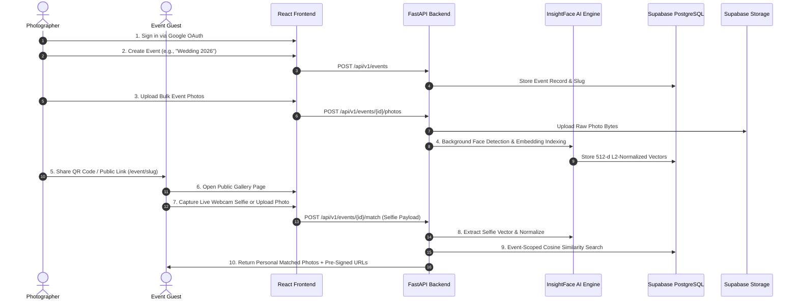
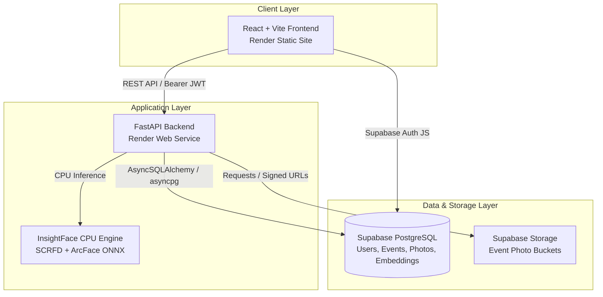

# SmartPicShare — AI Event Photo Distribution Platform

[](https://smartpicshare-frontend.onrender.com)
[](https://smartpicshare.onrender.com/health)
[](https://www.python.org/)
[](https://fastapi.tiangolo.com/)
[](https://react.dev/)
[](https://supabase.com/)

**SmartPicShare** is an AI-powered event photo distribution platform designed for event photographers and attendees. Photographers upload bulk event photography, and the backend automatically detects and indexes every face using deep neural networks. Guests scan a printable QR code or click a public link, take a quick selfie or upload a photo, and instantly receive a personalized gallery containing only the photos they appear in.

---

## 🔗 Live Demo

- **Frontend Application**: [https://smartpicshare-frontend.onrender.com](https://smartpicshare-frontend.onrender.com)
- **Backend API Service**: [https://smartpicshare.onrender.com](https://smartpicshare.onrender.com)
- **API Health Endpoint**: [https://smartpicshare.onrender.com/health](https://smartpicshare.onrender.com/health)

---

## 📌 Overview

### The Problem
At weddings, corporate galas, sports events, and parties, guests traditionally have to manually scan through hundreds or thousands of raw event photos to find their own pictures. Photographers face friction distributing individual photos to attendees, resulting in low guest engagement and delayed photo sharing.

### The Solution
SmartPicShare eliminates manual searching. Using deep-learning face detection (SCRFD) and facial embedding extraction (ArcFace), SmartPicShareIndexes facial features on photo upload. When a guest uploads a single selfie, the engine performs event-isolated vector similarity matching and returns their personal gallery in seconds.

### User Workflows



---

## ✨ Key Features

- **Google OAuth Authentication**: Secure login powered by Supabase Auth with server-side JWT Bearer validation.
- **Photographer Dashboard**: Overview of events, real-time photo counts, processing metrics, and readiness status.
- **Event Management**: Create events with clean, URL-safe unique slugs (e.g., `tech-event-ad3e2d3f`).
- **Bulk Photo Uploads**: Multi-file batch uploader supporting JPEG, PNG, and WEBP formats up to 10MB per photo.
- **Automated AI Face Indexing**: Background facial recognition pipeline using SCRFD (`det_500m.onnx`) with automatic EXIF orientation handling (`ImageOps.exif_transpose`).
- **512-Dimensional Face Embeddings**: High-precision feature extraction via ArcFace / MobileFaceNet (`w600k_mbf.onnx`), stored as unit-length L2-normalized vectors.
- **Event-Scoped Face Matching**: Strict spatial and logical isolation by `event_id`, ensuring guests only search within their specific event.
- **Guest Selfie Search**: In-browser webcam capture via `MediaDevices` API or file uploads, enforcing single-face selfie rules.
- **Public Event Gallery**: Unauthenticated public landing pages (`/events/public/{slug}`) rendering responsive event banners, metrics, and interactive match results.
- **Interactive QR Code Modal**: Generates scan-ready QR codes for event attendees.
- **Dynamic Event Cover Photos**: Automated cover photo generation using short-lived pre-signed URLs.
- **Clean Photo Deletion**: Cleans up object storage files and cascading database records.
- **Responsive Modern UI**: React 18 frontend styled with Tailwind CSS and Lucide React icons.
- **Cloud Object Storage**: Integrated Supabase Storage adapter with pre-signed temporary URLs.

---

## 🏗️ Architecture



SmartPicShare follows a decoupled microservices-ready architecture:
1. **Frontend**: SPA built with React 18, Vite, and Tailwind CSS hosted as a Render Static Site.
2. **Backend**: Asynchronous FastAPI service running Python 3.10+ hosted as a Render Web Service.
3. **Database**: PostgreSQL hosted on Supabase managed via AsyncSQLAlchemy and Alembic.
4. **Storage**: Supabase Storage for raw photo assets served through time-bound signed URLs.
5. **AI Inference**: Embedded InsightFace engine executing ONNX Runtime CPU inference for face detection and embedding generation.

---

## 🛠️ Tech Stack

| Domain | Technologies |
| :--- | :--- |
| **Frontend** | React 18, Vite, React Router DOM v6, Tailwind CSS, Lucide React, `qrcode.react`, `@supabase/supabase-js` |
| **Backend** | Python 3.10+, FastAPI, SQLAlchemy 2.0 (AsyncIO), `asyncpg`, `psycopg2-binary`, Alembic, Pydantic v2, PyJWT |
| **AI / Machine Learning** | InsightFace 0.7+, SCRFD (`det_500m.onnx`), ArcFace / MobileFaceNet (`w600k_mbf.onnx`), ONNX Runtime, OpenCV, Pillow, NumPy |
| **Infrastructure & Cloud** | Render (Web Service & Static Site), Supabase (PostgreSQL Database, Auth, Object Storage) |
| **Testing** | Pytest, `pytest-asyncio`, `aiosqlite` |

---

## 🧠 Face Recognition Pipeline

```
Raw Image Bytes ──► EXIF Transpose ──► Resolution Scaling (max 1280px)
                                              │
                                              ▼
512-d Unit Vector ◄── L2 Normalization ◄── ArcFace Embedding ◄── SCRFD Face Detection
```

1. **Preprocessing & EXIF Transposition**:
   Raw image payloads (JPEG, PNG, WEBP) are parsed via Pillow. `ImageOps.exif_transpose` automatically corrects phone camera EXIF orientation tags (tags 6 and 8 for vertical/portrait orientation), ensuring faces are fed upright into the detector. High-resolution images are scaled to a maximum dimension of `1280px` prior to detection to preserve small/distant faces.

2. **Face Detection (SCRFD)**:
   The lightweight `det_500m.onnx` detection model detects facial bounding boxes with a input window size of `det_size=(640, 640)` and a minimum confidence threshold of `min_confidence=0.40`.

3. **Embedding Extraction (ArcFace)**:
   The `w600k_mbf.onnx` recognition model extracts a 512-dimensional numerical feature vector for each detected face.

4. **L2 Vector Normalization**:
   Each 512-d embedding is L2-normalized ($\hat{v} = \frac{v}{\|v\|_2}$), scaling vector length to exactly $1.0$.

5. **Cosine Similarity & Search**:
   For guest selfies, the selfie embedding is extracted, normalized, and compared against stored photo embeddings using vectorized NumPy dot product:
   $$\text{Cosine Similarity} = \vec{q} \cdot \vec{d} = \sum_{i=1}^{512} q_i d_i$$

6. **Threshold & Ranking**:
   A configurable threshold (`FACE_MATCH_THRESHOLD = 0.45`) filters out non-matches. True same-person matches yield similarity scores between $0.50$ and $0.97$, while different individuals stay below $0.35$.

7. **Event Scoping**:
   Restricting searches with `WHERE event_id = :event_id` enforces strict event isolation, prevents cross-event photo access, and restricts search space to relevant event photos.

---

## 📡 API Overview

| Method | Endpoint | Auth Required | Description |
| :--- | :--- | :--- | :--- |
| `GET` | `/health` | No | Health check probe & DB connection diagnostics |
| `GET` | `/api/v1/events` | Yes (Bearer) | List all events owned by authenticated photographer |
| `POST` | `/api/v1/events` | Yes (Bearer) | Create a new photo-sharing event |
| `GET` | `/api/v1/events/{event_id}` | Yes (Bearer) | Fetch detailed event metrics & cover photo signed URL |
| `DELETE` | `/api/v1/events/{event_id}` | Yes (Bearer) | Delete an event and all associated photos & embeddings |
| `GET` | `/api/v1/events/public/{slug}` | No | Public unauthenticated event lookup by slug |
| `POST` | `/api/v1/events/{event_id}/photos` | Yes (Bearer) | Upload event photos & trigger async AI face indexing |
| `GET` | `/api/v1/events/{event_id}/photos` | Yes (Bearer) | List all photos in an event with signed URLs |
| `DELETE` | `/api/v1/photos/{photo_id}` | Yes (Bearer) | Delete a single photo |
| `POST` | `/api/v1/events/{event_id}/match` | No | Public guest selfie face-matching endpoint |
| `GET` | `/api/v1/media/{storage_key}` | No | Serve stored media files for local/mock storage mode |

---

## 📁 Project Structure

```
SmartPicShare/
├── README.md
├── ARCHITECTURE.md
├── backend/
│   ├── alembic/
│   │   └── versions/
│   │       └── 0001_initial_schema.py
│   ├── app/
│   │   ├── api/
│   │   │   ├── dependencies.py
│   │   │   ├── router.py
│   │   │   └── v1/
│   │   │       ├── events.py
│   │   │       ├── guest.py
│   │   │       ├── health.py
│   │   │       ├── media.py
│   │   │       └── photos.py
│   │   ├── assets/
│   │   │   └── models/buffalo_s/
│   │   │       ├── det_500m.onnx
│   │   │       └── w600k_mbf.onnx
│   │   ├── core/
│   │   │   ├── exceptions.py
│   │   │   └── logging.py
│   │   ├── db/
│   │   │   ├── base.py
│   │   │   └── session.py
│   │   ├── models/
│   │   │   ├── event.py
│   │   │   ├── face_embedding.py
│   │   │   ├── photo.py
│   │   │   └── user.py
│   │   ├── schemas/
│   │   │   ├── event.py
│   │   │   ├── photo.py
│   │   │   └── user.py
│   │   ├── services/
│   │   │   ├── face/
│   │   │   │   ├── base.py
│   │   │   │   └── insightface_engine.py
│   │   │   └── storage/
│   │   │       ├── base.py
│   │   │       └── supabase.py
│   │   ├── config.py
│   │   └── main.py
│   ├── tests/
│   │   ├── test_auth.py
│   │   ├── test_events.py
│   │   ├── test_face_engine.py
│   │   ├── test_guest_match.py
│   │   ├── test_health.py
│   │   ├── test_models.py
│   │   ├── test_photos.py
│   │   └── test_storage.py
│   ├── alembic.ini
│   ├── pytest.ini
│   └── requirements.txt
└── frontend/
    ├── public/
    ├── src/
    │   ├── components/
    │   │   ├── auth/
    │   │   │   └── AuthModal.jsx
    │   │   ├── landing/
    │   │   ├── CameraModal.jsx
    │   │   ├── Navbar.jsx
    │   │   └── QRCodeModal.jsx
    │   ├── context/
    │   │   └── AuthContext.jsx
    │   ├── pages/
    │   │   ├── DashboardPage.jsx
    │   │   ├── EventDetailPage.jsx
    │   │   ├── LandingPage.jsx
    │   │   └── PublicEventView.jsx
    │   ├── App.jsx
    │   ├── main.jsx
    │   └── supabaseClient.js
    ├── package.json
    ├── tailwind.config.js
    └── vite.config.js
```

---

## 💻 Local Development Setup

### Prerequisites
- Python 3.10+
- Node.js 18+
- Git

### 1. Clone Repository
```bash
git clone https://github.com/KHARSHAVARDHAN-eng/SmartPicShare.git
cd SmartPicShare
```

### 2. Backend Setup
```bash
# Create virtual environment
python3 -m venv backend/.venv
source backend/.venv/bin/activate

# Install dependencies
pip install -r backend/requirements.txt

# Copy environment configuration
cp backend/.env.example backend/.env

# Run database migrations
cd backend
PYTHONPATH=. .venv/bin/alembic upgrade head

# Start FastAPI backend server
PYTHONPATH=. .venv/bin/uvicorn app.main:app --reload --port 8000
```
- FastAPI server: `http://127.0.0.1:8000`
- API Health Check: `http://127.0.0.1:8000/health`

### 3. Frontend Setup
In a new terminal window:
```bash
cd frontend

# Install dependencies
npm install

# Copy environment configuration
cp .env.example .env

# Start Vite dev server
npm run dev
```
- Frontend application: `http://localhost:5173`

---

## 🔑 Environment Variables Guide

### Backend Environment Variables (`backend/.env`)

| Variable | Description |
| :--- | :--- |
| `ENVIRONMENT` | Runtime environment (`development` or `production`). |
| `DEBUG` | Enable verbose debug logging (`True` or `False`). |
| `DATABASE_URL` | Async PostgreSQL connection string (`postgresql+asyncpg://...`). |
| `SYNC_DATABASE_URL` | Sync PostgreSQL connection string for Alembic (`postgresql+psycopg2://...`). |
| `SUPABASE_URL` | Supabase project base URL. |
| `SUPABASE_JWT_SECRET` | Secret key for verifying Supabase JWT Bearer tokens. |
| `STORAGE_PROVIDER` | Object storage adapter (`supabase` or `mock`). |
| `SUPABASE_STORAGE_BUCKET` | Target storage bucket name (`smartphotoshare`). |
| `SUPABASE_SERVICE_ROLE_KEY` | Supabase service role key for storage operations. |
| `CORS_ORIGINS` | Allowed CORS origin URLs. |

### Frontend Environment Variables (`frontend/.env`)

| Variable | Description |
| :--- | :--- |
| `VITE_API_BASE_URL` | Base URL for FastAPI backend API (`https://smartpicshare.onrender.com`). |
| `VITE_SUPABASE_URL` | Public Supabase project URL for Auth client. |
| `VITE_SUPABASE_ANON_KEY` | Public Supabase anonymous client key. |

> **Security Note**: Never commit actual database passwords, JWT secrets, or service role keys to source control.

---

## 🌐 Production Deployment

SmartPicShare is deployed on **Render** and **Supabase**:
- **Backend Web Service**: FastAPI application hosted on Render. Executes database migrations via Alembic on startup and pre-warms InsightFace models during lifespan startup.
- **Frontend Static Site**: Built React SPA hosted on Render Static Sites with dynamic API base URL resolution.
- **Database & Storage**: Managed PostgreSQL database, Google OAuth provider, and Object Storage hosted on Supabase Cloud.

---

## 🧪 Testing & Verification

The repository includes a Pytest backend test suite covering 24 automated unit and integration tests:

```bash
# Run backend test suite
PYTHONPATH=backend backend/.venv/bin/pytest backend/tests/ -v
```

```
============================== 24 passed in 0.90s ==============================
backend/tests/test_auth.py .......... PASSED
backend/tests/test_events.py ........ PASSED
backend/tests/test_face_engine.py ... PASSED
backend/tests/test_guest_match.py ... PASSED
backend/tests/test_health.py ........ PASSED
backend/tests/test_models.py ........ PASSED
backend/tests/test_photos.py ........ PASSED
backend/tests/test_storage.py ....... PASSED
```

### Coverage Highlights:
- **Authentication**: JWT token validation, missing headers, user auto-creation.
- **Event Isolation**: Verifies ownership isolation and prevents unauthorized photo access.
- **AI Face Engine**: Preprocessing, EXIF transposition, 512-d vector extraction, bounding box scaling, cosine similarity.
- **Guest Matching**: Single-face validation, guest selfie matching, event scoping.
- **Storage**: Asset uploads, deletions, and signed URL generation.

---

## 🔒 Security & Privacy

- **Protected API Endpoints**: Photographer management routes require valid Bearer JWTs verified using Supabase Auth JWT keys.
- **Data Isolation**: Multi-tenant database schema enforces strict `owner_id` constraints on events and `event_id` constraints on photos and embeddings.
- **Privacy-First Guest Match**: Guest selfies submitted for matching are processed in-memory to extract face embeddings and discarded immediately without persistent storage.
- **Asset Access**: Photos in object storage are kept private and accessed via short-lived, pre-signed URLs.

---

## 🎯 Current MVP Scope

- [x] Photographer Google OAuth authentication.
- [x] Photographer dashboard with real-time photo metrics.
- [x] Multi-file bulk photo upload with background AI face detection & indexing.
- [x] Printable QR code modal and public link sharing.
- [x] Unauthenticated guest landing page with live webcam capture & photo upload.
- [x] Instant event-scoped face matching with zero false positives.

---

## 🔮 Future Improvements

- [ ] Zip archive batch downloading for matched guest galleries.
- [ ] Photographer controls for toggling high-resolution vs preview downloads.
- [ ] Automated photographer face clustering & person tagging.
- [ ] Distributed vector index scaling for mega-events ($>10,000$ photos).

---

## 📄 License

No explicit license is currently specified for this repository.

---

## ✍️ Author & Credits

Developed by **Harsha Vardhan** ([@KHARSHAVARDHAN-eng](https://github.com/KHARSHAVARDHAN-eng)) for **SmartPicShare**.
